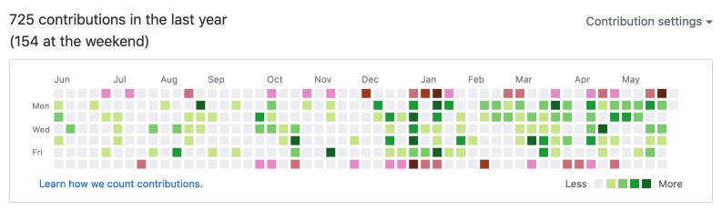

# GitHub Weekends

A silly browser extension that marks weekend contributions on GitHub's contribution graph in red.

## Example

Here is what it does when run on [@philnash's GitHub profile](https://github.com/philnash):

## Why?

The GitHub contribution graph is a blunt tool for demonstrating work you have done within GitHub. Some people enjoy this gamification and try to build streaks. Building a streak requires committing every day and this may work for some and [be harmful for others](https://github.com/isaacs/github/issues/627). 

Some people decide [the contribution graph is just there to messed with](https://github.com/gelstudios/gitfiti).

Me? I like to know when I'm working too much and not getting enough rest. That can be signified by overdoing it at the weekends. This browser extension shows the number of contributions on weekends and highlights those days on the graph in a different colour.

The colour is not a judgement, but it tries to delineate between coding during work and during time off. You can use this extension to decide what you want to do with that information.

## License

MIT (c) 2020 Phil Nash